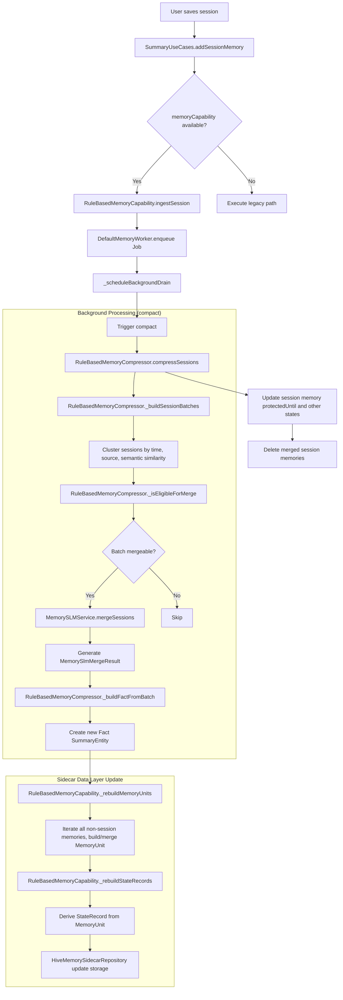

# Memory Enhancement Process

> Last Updated: 2026-03-24  
> This document records the enhancement evolution of Local Vault's memory system, focusing on state compression,
> structured title generation, and Hybrid Memory architecture implementation.

## Current Status

The first two phases of the memory enhancement plan have been completed and verified. We are now entering the
implementation phase of the three-layer Hybrid Memory architecture.

**Technical Roadmap**:

- ✅ **Pure Rule Engine**: Default solution, no dependency on native inference
- ✅ **State Compression Layer**: Supports overwrite updates for task/project/topic/preference states
- ✅ **Structured Title Generation**: Synonym normalization and standard topic mapping based on Topic Taxonomy
- 🔮 **Hybrid Memory**: In progress, layered retrieval and context construction
- 🔮 **Cloud Enhancement (Optional)**: Future optional extension direction

### Phase 1: State Compression Layer Enhancement ✅ (Completed - 2026-03-23)

**Objective**: Introduce a sidecar state recording layer that supports overwrite updates without breaking the existing
`session / fact / core` structure.

**Completion Status**:

- [x] Established independent module in `lib/core/memory_runtime/`; main app depends only on `MemoryCapability`, not
  directly on specific compressor, retriever, or model implementations.
- [x] Fixed runtime interfaces: `MemoryIngestor`, `MemoryCompressor`, `MemoryMerger`, `MemoryRetriever`,
  `ContextAssembler`, `MemoryWorker`, `MemoryPolicy`.
- [x] Fixed `MemoryCapability` facade methods: `ingestSession`, `retrieve`, `buildContext`, `compact`, `diagnose`.
- [x] Consolidated existing responsibilities: `SummaryUseCases` retains only current save/summary entry points and
  background task triggering; `MemorySLMService` is only responsible for semantic extraction and structured generation,
  no longer carrying long-term memory governance.
- [x] Added sidecar memory data layer; without replacing existing `SummaryEntity` / `summaries_v3`, added `StateRecord`,
  `MemoryUnit`, `ArchiveRecord` for parallel storage.
- [x] Implemented asynchronous write pipeline: user interaction path only writes session/summary; background
  `MemoryWorker` consumes new records and completes compression, merging, and state updates.
- [x] Implemented `Compression First`: multi-round sessions are first compressed into single `MemoryUnit`, then merged
  by topic; merged output must be shorter or higher information density.
- [x] Extended StateRecord schema to support task_state / project_state / user_preference_state / topic_state
- [x] Implemented compressToState method in RuleBasedMemoryCompressor
- [x] Implemented state overwrite update and version control
- [x] Optimized _rebuildStateRecords logic to support multi-type state derivation
- [x] Fixed first batch of state schemas: `task_state`, `project_state`, `topic_state`, `user_preference_state`;
  prioritize overwrite update when matched, no infinite appending.
- [x] Kept rule engine as default and fallback implementation; rule path must work independently after new runtime
  integration.

**Detailed Documentation**: `docs/implementation/state_compression_enhancement.md`

### Phase 2: Structured Title Generation Enhancement ✅ (Completed - 2026-03-23)

**Objective**: Build Topic Taxonomy system to achieve synonym normalization and standard topic mapping for title
generation.

**Completion Status**:

- [x] Built Topic Taxonomy whitelist and synonym mapping table (`assets/config/topic_taxonomy.json`)
- [x] Added synonym normalization logic to StructuredMemoryTitleGenerator
- [x] Implemented topic mapping to canonical topic
- [x] Optimized candidate scoring mechanism and dynamic title length compression (8-20 characters)
- [x] Added multi-language support (Chinese, English, Spanish, French, etc.)
- [x] Implemented word boundary matching mechanism to avoid mismatches
- [x] Verified optimization effects through 19 test cases
- [x] Implemented vector-free retrieval: scoring uses only `keywords`, `topic`, time decay, `importance`,
  `RuleSemanticProfile` similarity.
- [x] Fixed context construction rules: prioritize `StateRecord`, supplement with `MemoryUnit` if insufficient, by
  default do not read `ArchiveRecord`; finally return only 3 to 5 memories.

**Detailed Documentation**: `docs/implementation/stage2_title_generation_enhancement.md`

### Phase 3: Hybrid Memory Three-Layer Architecture Implementation 🚧 (In Progress)

**Objective**: Implement layered reading strategy and intelligent retrieval to improve context construction quality and
performance.

**Action Items**:

- [ ] Create HybridMemoryVault class to implement layered reading strategy
- [ ] Implement Layer 1/2/3 intelligent retrieval in RuleBasedMemoryRetriever
  - Layer 1: StateRecord (current active state)
  - Layer 2: MemoryUnit (recent memory units)
  - Layer 3: ArchiveRecord (historical archive, optional)
- [ ] Integrate buildContext into existing memory runtime process
- [ ] Performance benchmark and integration tests
- [ ] Ensure three-layer retrieval stably returns 3 to 5 context items without vectors

### Phase 4: User Experience Optimization ⏳ (Planned)

**Objective**: Transparently display current operation mode and advantages to users.

**Action Items**:

- [ ] Settings page explains current use of "Rule Mode" and its advantages
- [ ] Add degradation hints (fast, offline, privacy)
- [ ] Design optional "Cloud Enhancement" toggle
- [ ] UI continues to use existing `session / fact / core` terminology, without exposing engineering terms like
  `StateRecord / MemoryUnit`

### Key Interfaces and Types

- `MemoryCapability`: Single facade, responsible for ingestion, retrieval, context construction, compression triggering,
  and diagnosis.
- `StateRecord`: `namespace / key / summary / topic / keywords / importance / version / updatedAt`.
- `MemoryUnit`: `id / summary / topic / keywords / importance / sourceIds / createdAt / updatedAt / confidence`.
- `ArchiveRecord`: `id / sourceType / payload / createdAt / retentionTag`.
- `MemoryCompressionJob`: Background task object, responsible for deriving compression tasks from session/summary.
- `MemoryRetrievalResult` / `MemoryContextBundle`: Retrieval output and final context output, consumed directly by main
  conversation pipeline.
- `StatePatch`: State update result from single model or rule engine, used for `StateRecord` overwrite writing.
- `RuleSemanticProfile`: Semantic profile, including
  `domainKey / facetKey / displayTopic / displayTitle / tags / keywords`.

### Mid-term Goals (Adjusted to Pure Rule Engine + Optional Cloud Enhancement)

According to technical roadmap adjustments, the original "integrate single SLM" goal has been revised to:

- [x] **Pure Rule Engine Implementation**: BM25-lite + Jaccard composite similarity, `RuleSemanticProfile` semantic
  profile
- [ ] **State Layer Perfection**: Verify "continuous compression of same topic", "state overwrite update", "stable
  return of 3 to 5 context items" on real data
- [ ] **Complete Hybrid Memory Implementation**: Three-layer retrieval, context construction, performance optimization
- [ ] **Optional Cloud Enhancement**: If enabled, integrate single cloud LLM (DeepSeek, Tongyi Qianwen, etc.),
  maintaining "single model principle"
- [ ] **Model Resource Management**: If cloud enhancement is enabled, manage model status, version, cache path, and
  runtime availability
- [ ] **iOS Adaptation**: Rule engine priority, cloud enhancement optional
- [ ] **Data Encryption Capability**: Sensitive data can be optionally encrypted for storage
- [ ] **Backup/Restore Enhancement**: Conflict handling, version management

### Testing and Acceptance

**Completed Verification**:

- [x] Save, share, quick access, foreground interaction latency not degraded by memory processing; all memory processing
  completed in background.
- [x] Single session can asynchronously generate `MemoryUnit`; multiple same-topic sessions can be compressed into
  shorter memory.
- [x] When hitting same `task_state / project_state / topic_state / user_preference_state`, behavior shows overwrite
  update, not repeated accumulation.
- [x] Vector-free retrieval can stably return 3 to 5 context items, prioritizing current state hits.
- [x] When SLM unavailable, rule engine can still complete basic output of `summary / topic / keywords / compression`.
- [x] When new runtime closed or unregistered, existing `session / fact / core` functionality does not regress.
- [x] Old data can still be read normally without migration; new data progressively integrated through sidecar layer.
- [x] Verified title generation structured optimization effects through 19 test cases.

**To Be Continued Verification**:

- [ ] Performance of Hybrid Memory three-layer retrieval under large data volume
- [ ] Boundary scenarios of state overwrite update (frequent modifications, cross-topic switching)
- [ ] Stability of context construction in different scenarios (consistency of 3 to 5 item returns)

### Default Assumptions

The following assumptions remain unchanged:

- ✅ Continue evolving within current repository by default, no new repository, no independent SDK extraction.
- ✅ Default to sidecar storage first, no direct replacement of existing tables/boxes.
- ✅ Default UI continues to use existing `session / fact / core` terminology, without exposing engineering terms like
  `StateRecord / MemoryUnit`.
- ✅ Default `ArchiveRecord` only used for tracing, not involved in daily context construction.
- ✅ Default this plan written to `docs/ENHANCEMENT_PROCESS.md` as the sole baseline for subsequent implementation
  sequence.

### Technical Roadmap Change Notes

**Major Adjustment on 2026-03-19**:

- ❌ **Abandoned MediaPipe + GGUF Solution**: GGUF format not supported by MediaPipe
- ✅ **Switched to Pure Rule Engine**: BM25-lite + Jaccard + RuleSemanticProfile
- ✅ **Kept SLM Interface**: Support future integration with llama.cpp or other edge/cloud frameworks
- ✅ **Degradation Strategy**: Automatically fallback to rule engine when model unavailable, ensuring main process not
  interrupted

**Comparison of Advantages**:

| Dimension              | MediaPipe + GGUF (Abandoned)    | Pure Rule Engine (Current)      |
|------------------------|---------------------------------|---------------------------------|
| Package Size           | +500MB                          | -500MB                          |
| Response Speed         | 2-5s                            | < 50ms                          |
| Offline Capability     | ✅                               | ✅                               |
| Controllability        | Low (depends on native symbols) | High (pure Dart implementation) |
| Predictability         | Low                             | High                            |
| Multi-language Support | Limited                         | Complete (CJK + Latin)          |

