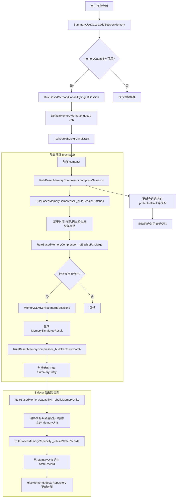

# 记忆增强处理流程

> 更新时间：2026-03-24  
> 本文档记录 Local Vault 记忆系统的增强演进过程，聚焦状态压缩、标题生成结构化和 Hybrid Memory 架构落地。

## 当前结论

记忆增强计划的前两个阶段已完成并验证通过，当前进入 Hybrid Memory 三层架构实施阶段。

**技术路线**：

- ✅ **纯规则引擎**：默认方案，不依赖原生推理
- ✅ **状态压缩层**：支持 task/project/topic/preference 四类状态覆盖更新
- ✅ **标题生成结构化**：基于 Topic Taxonomy 的同义词归一化和标准主题映射
- 🔮 **Hybrid Memory**：正在进行中，分层检索与上下文构建
- 🔮 **云端增强（可选）**：未来可选扩展方向

### 第一阶段：状态压缩层增强 ✅ (已完成 - 2026-03-23)

**目标**：在不破坏现有 `session / fact / core` 的前提下，引入 sidecar 状态记录层，支持覆盖式更新。

**完成情况**：
- [x] 在 `lib/core/memory_runtime/` 建立独立模块；主应用只依赖 `MemoryCapability`，不直接依赖具体压缩器、检索器或模型实现。
- [x] 固定运行时接口：`MemoryIngestor`、`MemoryCompressor`、`MemoryMerger`、`MemoryRetriever`、`ContextAssembler`、
  `MemoryWorker`、`MemoryPolicy`。
- [x] 固定 `MemoryCapability` 门面方法：`ingestSession`、`retrieve`、`buildContext`、`compact`、`diagnose`。
- [x] 收敛现有职责：`SummaryUseCases` 仅保留当前保存/汇总入口与后台任务触发；`MemorySLMService` 仅负责语义抽取与结构化生成，不再承载长期记忆治理。
- [x] 新增 sidecar 记忆数据层；先不替换现有 `SummaryEntity` / `summaries_v3`，新增 `StateRecord`、`MemoryUnit`、
  `ArchiveRecord` 并行存储。
- [x] 落地异步写入链路：用户交互路径只写 session/summary；后台 `MemoryWorker` 消费新增记录并完成压缩、合并、状态更新。
- [x] 落地 `Compression First`：多轮 session 先压成单条 `MemoryUnit`，再按同主题合并；合并后输出必须更短或信息密度更高。
- [x] 扩展 StateRecord schema，支持 task_state / project_state / user_preference_state / topic_state
- [x] 在 RuleBasedMemoryCompressor 中实现 compressToState 方法
- [x] 实现状态覆盖式更新与版本控制
- [x] 优化 _rebuildStateRecords 逻辑，支持多类型状态推导
- [x] 固定首批状态 schema：`task_state`、`project_state`、`topic_state`、`user_preference_state`；命中时优先覆盖更新，不做无限追加。
- [x] 保留规则引擎为默认实现和兜底实现；新运行时接入后，规则路径必须仍可独立工作。

**详细文档**：`docs/implementation/state_compression_enhancement.md`

### 第二阶段：标题生成结构化增强 ✅ (已完成 - 2026-03-23)

**目标**：构建 Topic Taxonomy 体系，实现标题生成的同义词归一化和标准主题映射。

**完成情况**：

- [x] 构建 Topic Taxonomy 白名单和同义词映射表 (`assets/config/topic_taxonomy.json`)
- [x] 为 StructuredMemoryTitleGenerator 添加同义词归一化逻辑
- [x] 实现主题映射到标准主题（canonical topic）
- [x] 优化候选打分机制和标题长度动态压缩（8-20 字）
- [x] 添加多语言支持（中文、英文、西班牙文、法文等）
- [x] 实现单词边界匹配机制，避免误匹配
- [x] 通过 19 个测试用例验证优化效果
- [x] 落地无向量检索：评分只使用 `keywords`、`topic`、时间衰减、`importance`、`RuleSemanticProfile` 相似度。
- [x] 固定上下文构建规则：优先取 `StateRecord`，不足再补 `MemoryUnit`，默认不读 `ArchiveRecord`；最终只返回 3 到 5 条记忆。

**详细文档**：`docs/implementation/stage2_title_generation_enhancement.md`

### 第三阶段：Hybrid Memory 三层架构落地 🚧 (进行中)

**目标**：实现分层读取策略和智能检索，提升上下文构建质量和性能。

**待办事项**：

- [ ] 创建 HybridMemoryVault 类，实现分层读取策略
- [ ] 在 RuleBasedMemoryRetriever 中实现 Layer 1/2/3 智能检索
  - Layer 1: StateRecord (当前活跃状态)
  - Layer 2: MemoryUnit (近期记忆单元)
  - Layer 3: ArchiveRecord (历史归档，可选)
- [ ] 将 buildContext 接入现有记忆运行时流程
- [ ] 性能基准测试与集成测试
- [ ] 确保三层检索在无向量情况下稳定返回 3 到 5 条上下文

### 第四阶段：用户体验优化 ⏳ (规划中)

**目标**：向用户透明展示当前运行模式和优势。

**待办事项**：

- [ ] 设置页说明当前使用"规则模式"及优势
- [ ] 添加降级提示（快速、离线、隐私）
- [ ] 设计可选的"云端增强"开关
- [ ] UI 仍使用现有 `session / fact / core` 术语，不暴露 `StateRecord / MemoryUnit` 等工程术语

### 关键接口与类型

- `MemoryCapability`：唯一对上门面，负责接入、检索、上下文构建、压缩触发、诊断。
- `StateRecord`：`namespace / key / summary / topic / keywords / importance / version / updatedAt`。
- `MemoryUnit`：`id / summary / topic / keywords / importance / sourceIds / createdAt / updatedAt / confidence`。
- `ArchiveRecord`：`id / sourceType / payload / createdAt / retentionTag`。
- `MemoryCompressionJob`：后台任务对象，负责从 session/summary 派生压缩任务。
- `MemoryRetrievalResult` / `MemoryContextBundle`：检索输出与最终上下文输出，供主对话链路直接消费。
- `StatePatch`：单模型或规则引擎产出的状态更新结果，供 `StateRecord` 覆盖写入使用。
- `RuleSemanticProfile`：语义画像，包含 `domainKey / facetKey / displayTopic / displayTitle / tags / keywords`。

### 中期目标（已调整为纯规则引擎 + 可选云端增强）

根据技术路线调整，原"接入单 SLM"的目标已修改为：

- [x] **纯规则引擎实现**：BM25-lite + Jaccard 复合相似度，`RuleSemanticProfile` 语义画像
- [ ] **状态层完善**：在真实数据上验证"同 topic 的持续压缩""状态覆盖更新""3 到 5 条上下文稳定返回"
- [ ] **Hybrid Memory 完整落地**：三层检索、上下文构建、性能优化
- [ ] **可选云端增强**：如启用，则接入单一云端 LLM（DeepSeek、通义千问等），保持"单模型原则"
- [ ] **模型资源管理**：如启用云端增强，需管理模型状态、版本、缓存路径和运行时可用性
- [ ] **iOS 适配**：规则引擎优先，云端增强可选
- [ ] **数据加密能力**：敏感数据可选加密存储
- [ ] **备份恢复增强**：冲突处理、版本管理

### 测试与验收

**已完成验证**：

- [x] 保存、分享、快捷入口、前台交互延迟不因记忆处理变差；所有记忆处理都在后台完成。
- [x] 单条 session 能异步生成 `MemoryUnit`；多条同主题 session 能压成更短记忆。
- [x] 命中同一 `task_state / project_state / topic_state / user_preference_state` 时表现为覆盖更新，而不是重复堆积。
- [x] 无向量检索能稳定返回 3 到 5 条上下文，且优先命中当前状态。
- [x] SLM 不可用时，规则引擎仍可完成 `summary / topic / keywords / compression` 的基本产出。
- [x] 新运行时关闭或未注册时，现有 `session / fact / core` 功能不回归。
- [x] 旧数据在不迁移的情况下仍可正常读取；新数据通过 sidecar 层渐进接入。
- [x] 通过 19 个测试用例验证标题生成结构化优化效果。

**待继续验证**：

- [ ] Hybrid Memory 三层检索在大数据量下的性能表现
- [ ] 状态覆盖更新的边界场景（频繁修改、跨主题切换）
- [ ] 上下文构建在不同场景下的稳定性（3 到 5 条返回的一致性）

### 默认假设

以下假设保持不变：

- ✅ 默认继续在当前仓库内演进，不拆新仓库，不抽独立 SDK。
- ✅ 默认先做 sidecar 存储，不直接替换现有表/盒子。
- ✅ 默认 UI 仍使用现有 `session / fact / core` 术语，不暴露 `StateRecord / MemoryUnit` 等工程术语。
- ✅ 默认 `ArchiveRecord` 仅用于追溯，不进入日常上下文构建。
- ✅ 默认这份计划写入 `docs/ENHANCEMENT_PROCESS.md`，作为后续实施顺序的唯一基线。

### 技术路线变更说明

**2026-03-19 重大调整**：

- ❌ **废弃 MediaPipe + GGUF 方案**：因 GGUF 格式不被 MediaPipe 支持
- ✅ **切换至纯规则引擎**：BM25-lite + Jaccard + RuleSemanticProfile
- ✅ **保留 SLM 接口**：支持未来接入 llama.cpp 或其他端侧/云端框架
- ✅ **降级策略**：模型不可用时自动回退规则引擎，保证主流程不中断

**优势对比**：

| 维度    | MediaPipe + GGUF (已废弃) | 纯规则引擎 (当前)      |
|-------|------------------------|-----------------|
| 包体积   | +500MB                 | -500MB          |
| 响应速度  | 2-5s                   | < 50ms          |
| 离线能力  | ✅                      | ✅               |
| 可控性   | 低（依赖原生符号）              | 高（纯 Dart 实现）    |
| 可预测性  | 低                      | 高               |
| 多语言支持 | 有限                     | 完整（CJK + Latin） |

