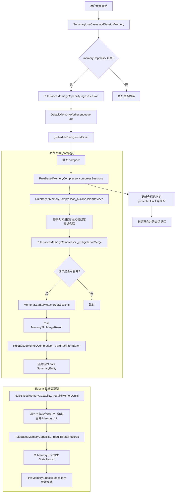

# ENHANCEMENT_PROCESS

简述：在不破坏现有 `session / fact / core` 的前提下，引入可拔插的 `Hybrid Memory Runtime`，先完成接口与异步链路，再完成状态层、压缩、检索，最后接入单模型
SLM。

### 近期目标

- [x] 在 `lib/core/memory_runtime/` 建立独立模块；主应用只依赖 `MemoryCapability`，不直接依赖具体压缩器、检索器或模型实现。
- [x] 固定运行时接口：`MemoryIngestor`、`MemoryCompressor`、`MemoryMerger`、`MemoryRetriever`、`ContextAssembler`、
  `MemoryWorker`、`MemoryPolicy`。
- [x] 固定 `MemoryCapability` 门面方法：`ingestSession`、`retrieve`、`buildContext`、`compact`、`diagnose`。
- [x] 收敛现有职责：`SummaryUseCases` 仅保留当前保存/汇总入口与后台任务触发；`MemorySLMService` 仅负责语义抽取与结构化生成，不再承载长期记忆治理。
- [x] 新增 sidecar 记忆数据层；先不替换现有 `SummaryEntity` / `summaries_v3`，新增 `StateRecord`、`MemoryUnit`、
  `ArchiveRecord` 并行存储。
- [x] 落地异步写入链路：用户交互路径只写 session/summary；后台 `MemoryWorker` 消费新增记录并完成压缩、合并、状态更新。
- [x] 落地 `Compression First`：多轮 session 先压成单条 `MemoryUnit`，再按同主题合并；合并后输出必须更短或信息密度更高。
- [x] 固定首批状态 schema：`task_state`、`project_state`、`topic_state`、`user_preference_state`；命中时优先覆盖更新，不做无限追加。
- [x] 落地无向量检索：评分只使用 `keywords`、`topic`、时间衰减、`importance`、`RuleSemanticProfile` 相似度。
- [x] 固定上下文构建规则：优先取 `StateRecord`，不足再补 `MemoryUnit`，默认不读 `ArchiveRecord`；最终只返回 3 到 5 条记忆。
- [x] 保留规则引擎为默认实现和兜底实现；新运行时接入后，规则路径必须仍可独立工作。

### 中期目标

- [ ] 在 `MemoryCompressor` / `MemoryMerger` 后面接入单 SLM，实现
  `summary / topic / keywords / importance / compression_action / state_patch` 的统一结构化输出。
- [ ] 保持“单模型原则”；不引入第二模型、embedding 或向量数据库。
- [ ] 新增 `ModelRuntimeProvider`，统一管理模型状态、版本、缓存路径和运行时可用性；`MemoryCapability` 不直接感知模型文件。
- [ ] 后续版本再加模型体积策略：Q2/Q3 量化、按需下载、不进安装包；这部分只预留接口，不提前侵入主流程。
- [ ] 在真实数据上补 fixture / golden；重点覆盖“同 topic 的持续压缩”“状态覆盖更新”“3 到 5 条上下文稳定返回”。

### 关键接口与类型

- `MemoryCapability`：唯一对上门面，负责接入、检索、上下文构建、压缩触发、诊断。
- `StateRecord`：`namespace / key / summary / topic / keywords / importance / version / updatedAt`。
- `MemoryUnit`：`id / summary / topic / keywords / importance / sourceIds / createdAt / updatedAt / confidence`。
- `ArchiveRecord`：`id / sourceType / payload / createdAt / retentionTag`。
- `MemoryCompressionJob`：后台任务对象，负责从 session/summary 派生压缩任务。
- `MemoryRetrievalResult` / `MemoryContextBundle`：检索输出与最终上下文输出，供主对话链路直接消费。
- `StatePatch`：单模型或规则引擎产出的状态更新结果，供 `StateRecord` 覆盖写入使用。

### 测试与验收

- [ ] 保存、分享、快捷入口、前台交互延迟不因记忆处理变差；所有记忆处理都在后台完成。
- [ ] 单条 session 能异步生成 `MemoryUnit`；多条同主题 session 能压成更短记忆。
- [ ] 命中同一 `task_state / project_state / topic_state / user_preference_state` 时表现为覆盖更新，而不是重复堆积。
- [ ] 无向量检索能稳定返回 3 到 5 条上下文，且优先命中当前状态。
- [ ] SLM 不可用时，规则引擎仍可完成 `summary / topic / keywords / compression` 的基本产出。
- [ ] 新运行时关闭或未注册时，现有 `session / fact / core` 功能不回归。
- [ ] 旧数据在不迁移的情况下仍可正常读取；新数据通过 sidecar 层渐进接入。

### 默认假设

- 默认继续在当前仓库内演进，不拆新仓库，不抽独立 SDK。
- 默认先做 sidecar 存储，不直接替换现有表/盒子。
- 默认 UI 仍使用现有 `session / fact / core` 术语，不暴露 `StateRecord / MemoryUnit` 等工程术语。
- 默认 `ArchiveRecord` 仅用于追溯，不进入日常上下文构建。
- 默认这份计划写入 `docs/ENHANCEMENT_PROCESS.md`，作为后续实施顺序的唯一基线。

